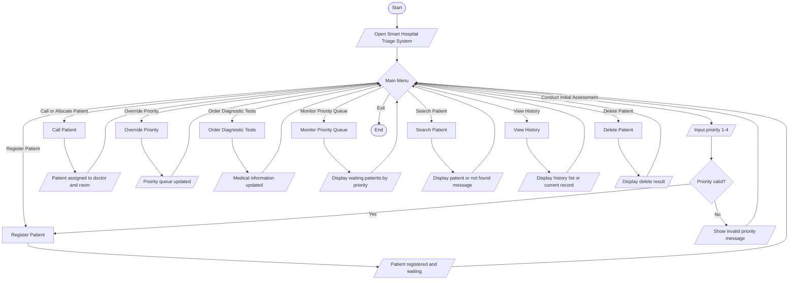
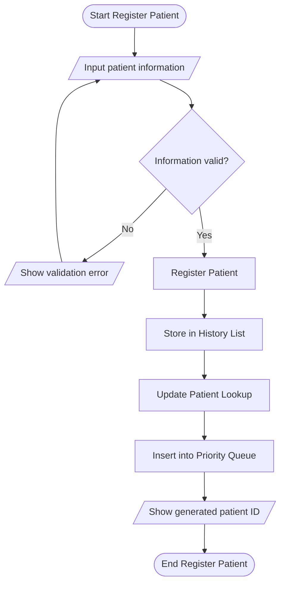
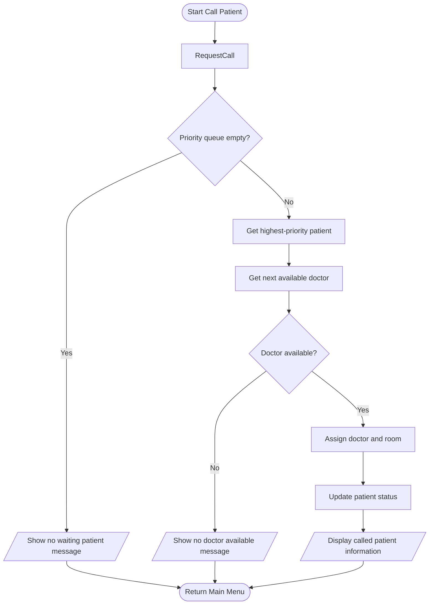
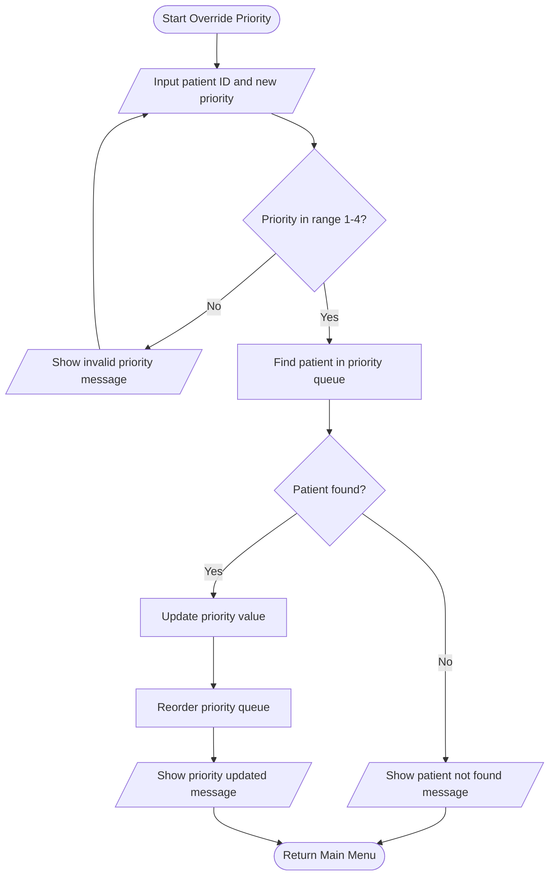
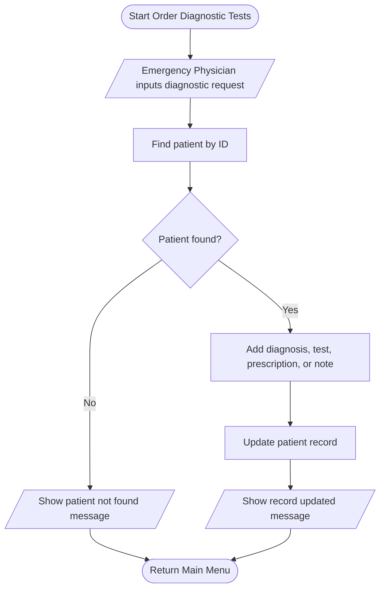
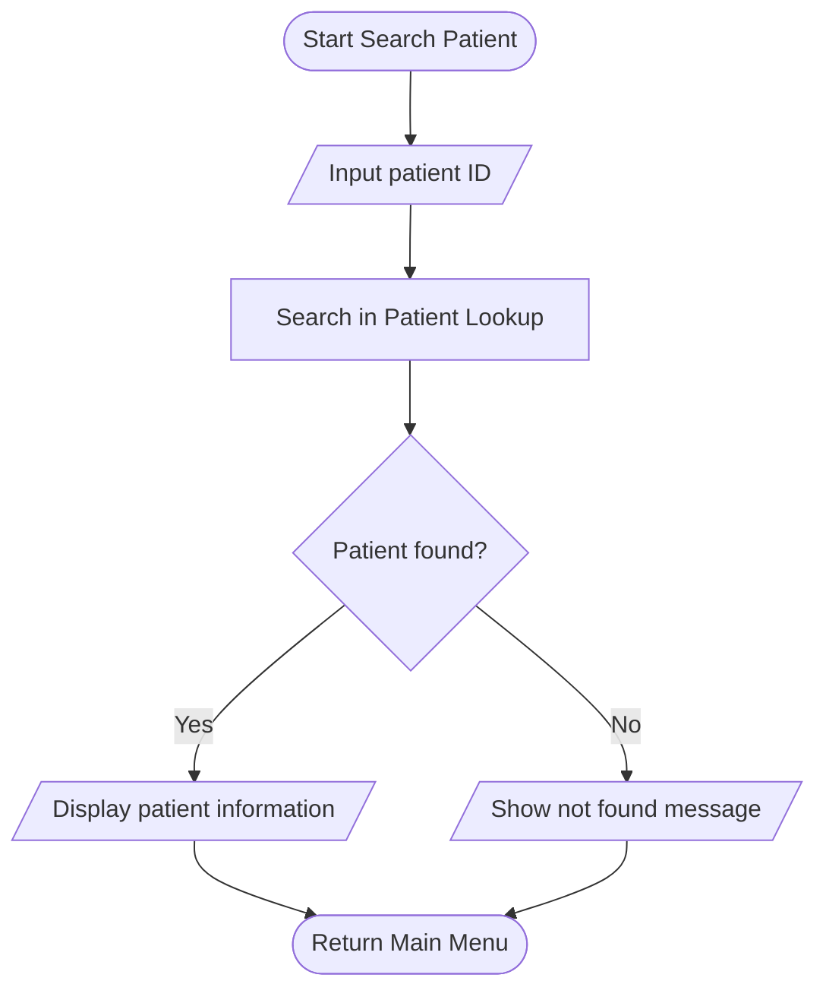
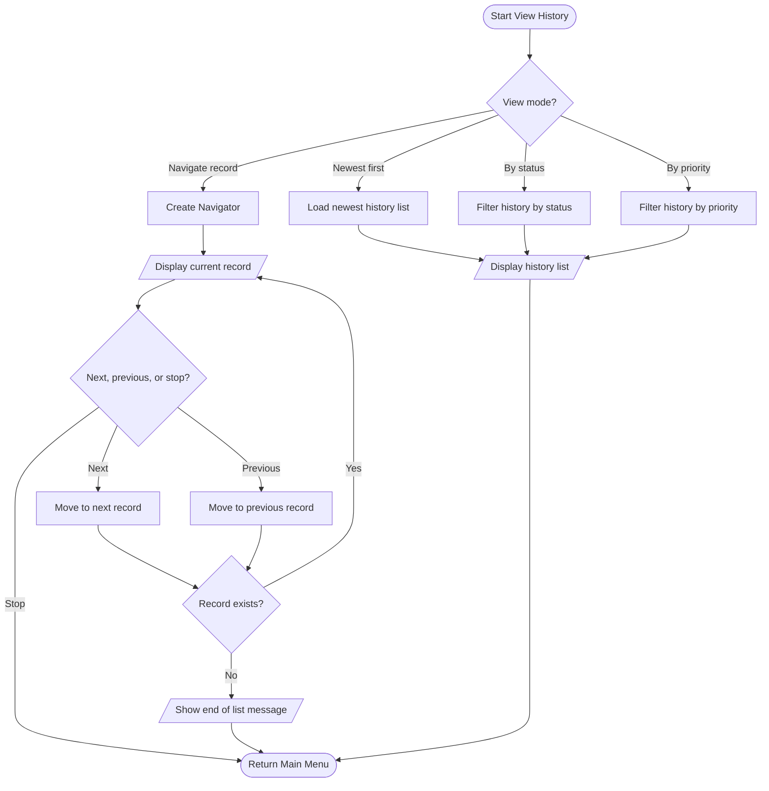
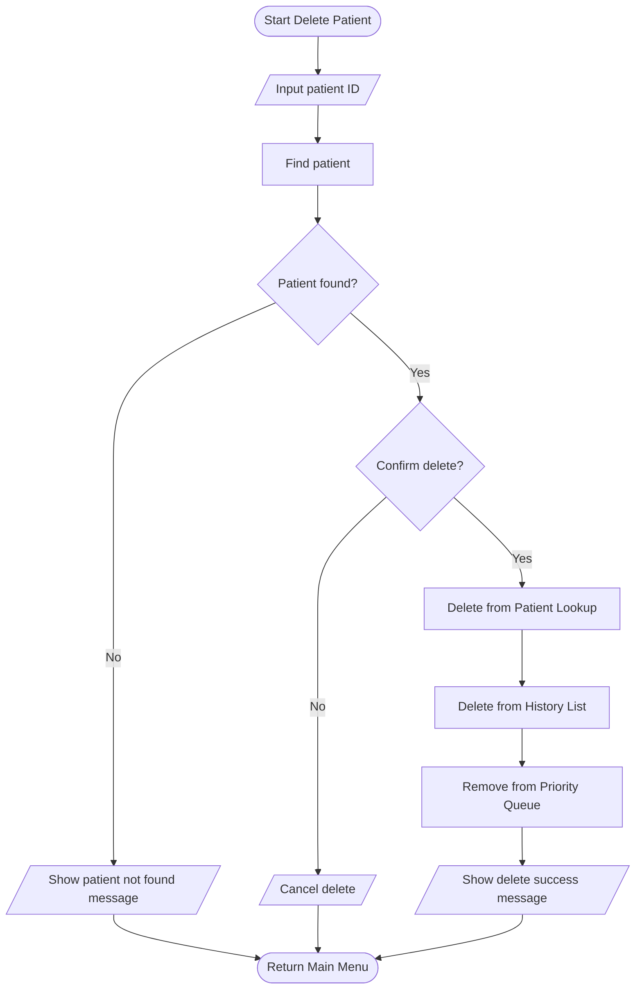

# Smart Hospital Patient Triage System - Flowchart

## 1. Flowchart tong quan he thong

## 2. Flowchart Register Patient

Register flow chay tuan tu: `Register Patient` dai dien cho nghiep vu dang ky benh nhan. Ben trong implementation hien tai, luong nay duoc map voi `HospitalService.register`, `DoublyLinkedList.push`, `HashTable.put` va `TriageMinHeap.push`.

## 3. Flowchart Call Patient / Allocate Bed

Flow nay gom use case `Allocate Bed by Priority` va `Call Patient`, vi ca hai deu lay benh nhan uu tien cao nhat tu priority queue, sau do phan cong bac si theo vong lap. Implementation tuong ung: `TriageMinHeap.pop`, `CircularLinkedList.nextDoctor` hoac `HospitalService.nextDoctor`, va `DoublyLinkedList.updateStatus`.

## 4. Flowchart Override Priority

Trong flow he thong, `Reorder priority queue` dai dien cho viec heap tu can bang lai. Chi tiet `heapifyUp` hay `heapifyDown` thuoc flow thuat toan cua `TriageMinHeap`, khong dat trong flow tong quan.

## 5. Flowchart Order Diagnostic Tests

Use case nay dung mot flow rieng, tranh lap lai `Order Tests` o nhieu vi tri trong flow tong quan.

## 6. Flowchart Search Patient

Search flow xem `HashTable` la lookup chinh cua benh nhan theo ID. `DoublyLinkedList` van dung cho View History, filter, navigate ho so, hoac kiem tra lich su khi can doi chieu du lieu.

## 7. Flowchart View History

Implementation tuong ung: `DoublyLinkedList.toListReverse`, `filterByStatus`, `filterByPriority`, `navigatorFromHead`, `navigatorFromTail`, `Navigator.next` va `Navigator.prev`.

## 8. Flowchart Delete Patient

Delete flow chay tuan tu: tim benh nhan truoc, neu tim thay va duoc xac nhan thi moi xoa khoi lookup, history list va priority queue. Cach nay tranh hieu nham rang cac cau truc du lieu xoa song song hoac van xoa khi benh nhan khong ton tai.

