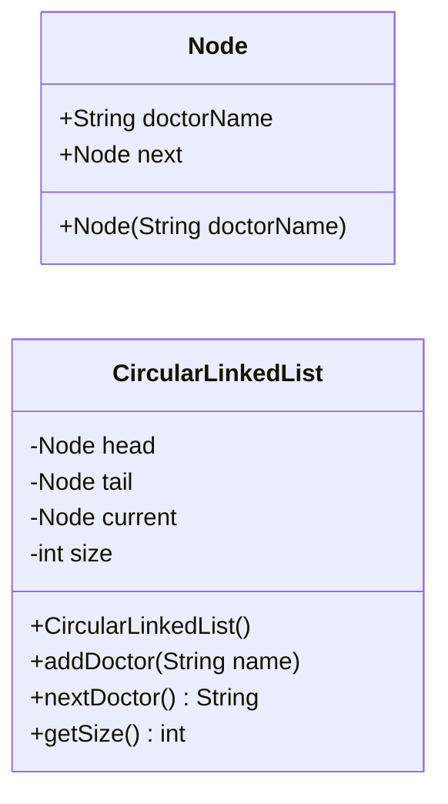

```mermaid
classDiagram
    direction LR
    
    class Node {
        +String doctorName
        +Node next
        +Node(String doctorName)
    }

    class CircularLinkedList {
        -Node head
        -Node tail
        -Node current
        -int size
        +CircularLinkedList()
        +addDoctor(String name)
        +nextDoctor() String
        +getSize() int
    }
```