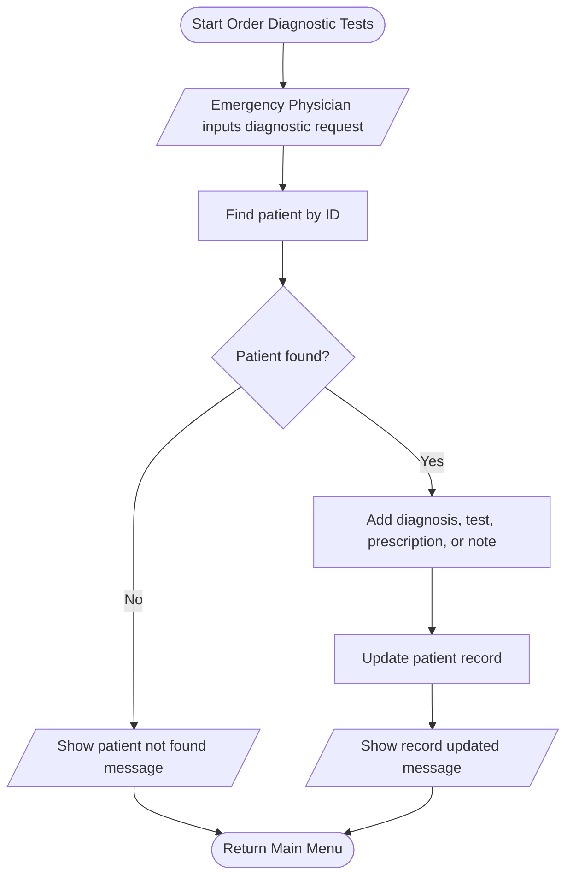

## 5. Flowchart Order Diagnostic Tests

```mermaid
flowchart TD
    Start([Start Order Diagnostic Tests])
    DoctorInput[/Emergency Physician inputs diagnostic request/]
    FindPatient[Find patient by ID]
    Found{Patient found?}

    Start --> DoctorInput --> FindPatient --> Found
    Found -->|No| NotFound[/Show patient not found message/]
    NotFound --> ReturnMenu([Return Main Menu])

    Found -->|Yes| AddTest[Add diagnosis, test, prescription, or note]
    AddTest --> UpdateRecord[Update patient record]
    UpdateRecord --> ShowResult[/Show record updated message/]
    ShowResult --> ReturnMenu
```

Use case nay dung mot flow rieng, tranh lap lai `Order Tests` o nhieu vi tri trong flow tong quan.
